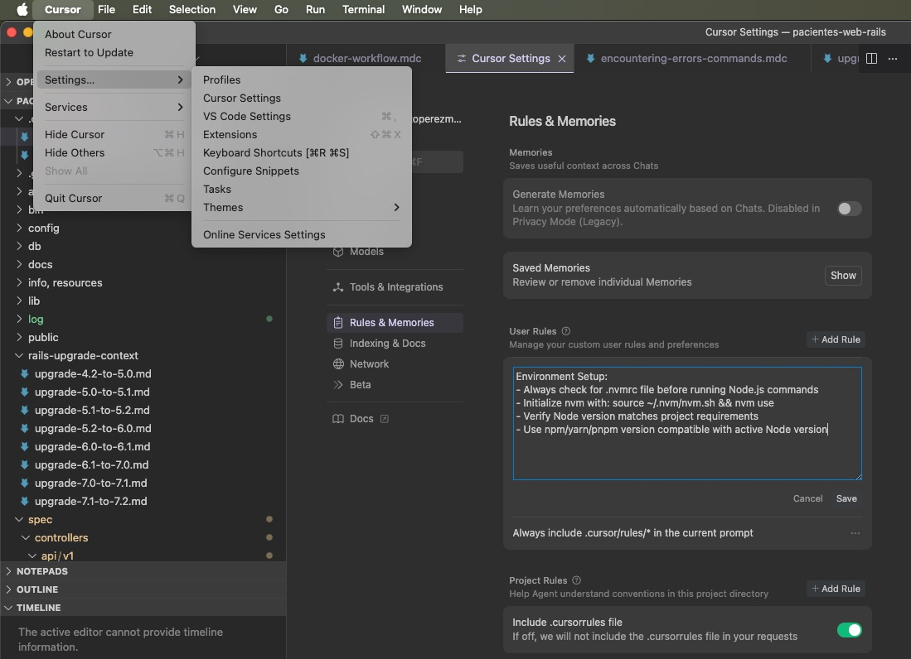

# Cursor AI.

## De la planeación a la ejecución

_Charla práctica sobre casos reales de uso_  
**Heriberto Magaña ·July 2025**

---

## ¿Qué es Cursor AI?

- **Entorno de desarrollo inteligente** basado en IA
- **Editor de código + Terminal + Navegador + Documentos**
- **Contexto persistente**: mantiene historial completo del proyecto
- **Orquestador de proyectos**: más que un simple editor

---

### **Chat tradicional (ChatGPT, Copilot):**

<ul style="list-style: none; padding-left: 0;">
  <li>❌ <strong>Conversaciones aisladas</strong> sin continuidad</li>
  <li>❌ <strong>Sin memoria</strong> entre sesiones</li>
  <li>❌ <strong>Respuestas genéricas</strong> sin contexto específico</li>
</ul>

<h3 style="margin-top: 30px"> Cursor Agent (Orquestador): </h3>

<ul style="list-style: none; padding-left: 0;">
  <li>✅ <strong>Memoria persistente</strong> del proyecto completo</li>
  <li>✅ <strong>Contexto continuo</strong> entre sesiones</li>
  <li>✅ <strong>Acciones ejecutables</strong> (código, comandos, archivos)</li>
  <li>✅ <strong>Orquestación inteligente</strong> de tareas complejas</li>
</ul>

---

  

    
  

  

    <h3 style="margin-top: 0; text-align: left">Contexto persistente</h3>
    <ul>
      <li><strong>Historial completo</strong> del proyecto siempre disponible</li>
      <li><strong>Documentación viva</strong> que se actualiza automáticamente</li>
      <li><strong>Trazabilidad</strong> de decisiones y cambios</li>
      <li><strong>Colaboración mejorada</strong> entre equipos</li>
      <li><strong>Onboarding rápido</strong> de nuevos miembros</li>
    </ul>
  

---

### **Comandos útiles:**

- `/` - Acceso rápido a comandos
- `Cmd/Ctrl + K` - Chat contextual
- `Cmd/Ctrl + L` - Chat con archivo actual
- `Cmd/Ctrl + Shift + L` - Chat con selección

<h3 style="margin-top: 30px">Mejores prácticas:</h3>

- **Documenta decisiones** en archivos .md
- **Usa contextos y reglas específicas** por proyecto
- **Mantén historial** de conversaciones importantes
- **Itera incrementalmente** en cambios complejos

---

### Configuración de reglas(user rules)

---

### Configuración de .cursor/rules

<ul>
  <li><strong>¿Qué son las reglas de Cursor?</strong>  
    Permiten definir comportamientos, restricciones y buenas prácticas para tu proyecto o equipo.
  </li>
  <li><strong>Ubicación:</strong>  
    Se guardan en la carpeta raiz <code>.cursor/rules/</code>
  </li>
  <li><strong>Formato .mdc:</strong>  
    <code>.mdc</code> (Markdown con metadatos). Este formato permite combinar texto, listas y bloques de código.
  </li>
  <li><strong>¿Cómo crear una regla?</strong>
    <ol>
      <li>Crear folder en raiz llamado <code>.cursor/rules</code>
      <li>Desde editor, click derecho crear nuevo archivo con extension .mdc, ejemplo: <code>naming-conventions.mdc</code></li>
      <li>Agrega un título, descripción y los puntos clave de la regla usando Markdown.</li>
      <li>Puedes incluir ejemplos de código, advertencias y enlaces útiles.</li>
    </ol>
  </li>

---

  <h3><strong>Ejemplo básico de archivo <code>.mdc</code>:</strong></h3>
    <pre>
---
description: Always verify complex errors via web search before proposing solutions
globs: ["**/*.rb", "Gemfile*"]
priority: high
alwaysApply: true
---
# Convenciones de nombres

- Usa camelCase para variables y funciones.
- Usa PascalCase para clases y componentes.
- No uses guiones bajos al inicio.
</pre>
<ul>
  <li><strong>Tips:</strong>
    <ul>
      <li>Organiza las reglas por tema o equipo.</li>
      <li>Actualiza las reglas conforme evoluciona el proyecto.</li>
      <li>Consulta las reglas desde la barra de comandos de Cursor.</li>
    </ul>
  </li>
</ul>

---

  

    
  

  

    <h2 style="margin-top: 0; text-align: left">Usos generales</h2>
    <ul>
      <li><strong>Planeación financiera</strong> o administrativa</li>
      <li><strong>Seguimiento por fases</strong> con documentación automática</li>
      <li><strong>Generación automática</strong> de reportes y dashboards</li>
      <li><strong>Validación y trazabilidad</strong> por documentos históricos</li>
      <li><strong>Gestión de stakeholders</strong> y comunicación</li>
    </ul>
  

---

  

    <h2 style="margin-top: 0; text-align: left">¿Quién puede beneficiarse?</h2>
    <ul>
      <li><strong>Desarrolladores y equipos técnicos</strong></li>
      <li><strong>Contadores y administrativos</strong></li>
      <li><strong>Project Managers y analistas</strong></li>
      <li><strong>Equipos interdisciplinarios</strong></li>
    </ul>
  

  

    
  

---

## Caso práctico: Upgrade de Rails 4.2 a 7.1

- Plan inicial generado via Claude UI(markdown files)
- Fases divididas por versiones
- Documentos técnicos por etapa
- Revisión automática del código y dependencias
- Seguimiento progresivo con rollback posible

---

## Upgrade de Rails 4.2 a 7.1

---

## Incremental upgrades #1

---

## Incremental upgrades #2

---

## Lecciones aprendidas del upgrade

- Cursor permite iterar cada fase de forma controlada
- Actualización de documentos conforme avanza el código
- Facilita testing, debugging y planificación paralela
- Mejora la documentación interna del proyecto

---

## Crear esta misma presentación con Cursor AI

- Temario escrito como documento base
- Segundo documento para las slides
- Comando a Cursor para:
  - Clonar plantilla Reveal.js
  - Insertar contenido de slides
  - Buscar imágenes en Unsplash/Pexels
- **Todo en menos de 15 minutos**

---

## Conclusiones

- **Cursor AI no es solo para programar: es para orquestar**
- Ideal para planear y ejecutar proyectos reales
- Mejora la productividad, la trazabilidad y el enfoque
- Se adapta tanto a equipos técnicos como administrativos

---

## Gracias 🙌

### ¿Preguntas?

